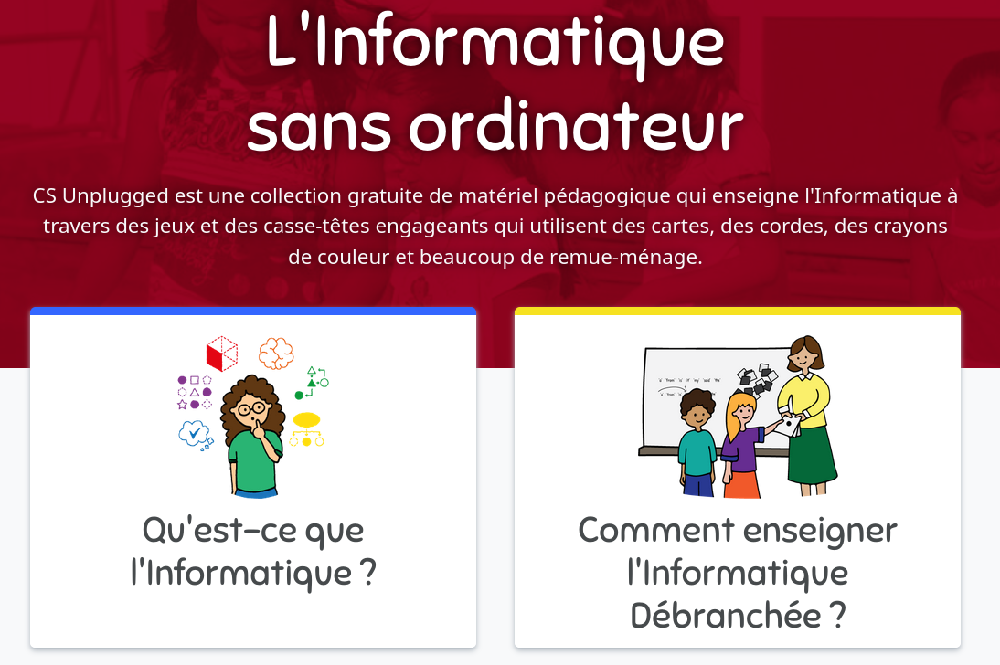
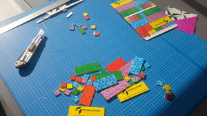

# L'informatique débranchée

## Qu'est ce que c'est ? 

Il s'agit de petits jeux de logique et autres casses-têtes auxquels on joue avec
des bouts de bois du carton ou du plastique pleins de couleurs, mais surtout
sans électronique. Il existe de nombreuses activités, couvrant presque tous les
concepts fondamentaux de l'informatique. Elles peuvent être utilisées en classe
ou lors d'événements comme la Fête de la science. Cette façon de faire découvrir
l'informatique avec les mains mais sans électronique a été popularisée au début
du siècle par des chercheurs néo-zélandais du groupe [CS
unplugged](https://www.csunplugged.org/fr/), fondé par Tim Bell. On trouve
beaucoup d'activités sur leur site, ainsi qu'une bonne introduction au concept.

 

## Avantages

Ces activités ont de nombreux avantages pour enseigner les concepts fondamentaux
de l'informatique. Tout d'abord, le matériel est facile à produire. Pour la
plupart des activités, il suffit d'avoir une imprimante couleur, du papier
autocollant, du carton plume (une couche de mousse prise entre deux feuilles de
papier) et de quoi découper. On trouve tout cela à bon prix dans n'importe quel
magasin d'arts créatifs, là où le prix des ordinateurs limite très sérieusement
l'équipement des classes.

Un autre avantage est que les élèves ont l'habitude d'apprendre en manipulant
des objets, tandis que les enseignants savent déjà enseigner ainsi. Quand on n'a que
quelques séances, il est bien pratique de pouvoir s'appuyer sur les habitudes de
la classe. Il serait bien plus difficile de faire des activités sur ordinateurs
avec des enfants n'en ayant jamais utilisé en classe avant cela. D'expérience,
il est très difficile de capter l'attention d'un groupe classe la première fois
qu'on va en salle machine, et cela peut prendre plusieurs séances avant que les
élèves apprennent à apprendre sur ordinateur. Se raccrocher aux méthodes
habituelles est donc bien plus pratique quand on n'a que quelques séances
ponctuelles.

Même avec des élèves rompus aux séances de TP sur machine comme à l'université,
enseigner sur machine pose de plus des défis spécifiques à l'enseignant car le
moindre problème technique empêche les élèves d'avancer. Si la tâche de
l'enseignant pendant un TP de programmation se résume souvent à trouver de bêtes
erreurs de syntaxe et à traduire les messages d'erreur de l'ordinateur en
français, le gros du travail de l'enseignant a lieu avant la séance. Il faut
tester les ordinateurs utilisés et se préparer à toutes les pannes et erreurs
possibles et imaginables. Là encore, ce genre de préparation serait
extrêmement difficile pour des interventions ponctuelles dans des écoles, où le
matériel informatique est souvent disparate et mal entretenu quand il existe.

À l'inverse, l'informatique débranchée permet de se concentrer sur les concepts
pendant la séance sans être gêné par le bruit de la technique. On n'est pas
distrait par une erreur de syntaxe insignifiante comme un point-virgule manquant
et on peut écouter l'enseignant sans chercher la subtilité technique qui fait
que ça marche avec sa version du système mais pas la nôtre.

Enfin, cette approche a l'avantage d'être inclusive, puisqu'il n'y a pas de
prérequis. Geeker à la maison avec papa ne donne pas d’avantage en classe, et
tous les élèves sont à égalité devant l'activité. Comme cela permet d’aborder de
vrais concepts complexes de l’informatique, c’est un bon outil pour réintégrer
gens habituellement exclus de la technologie. On peut même intégrer d'éventuels
enfants ne maîtrisant pas bien français, puisqu'il s'agit surtout de *manipuler
et réfléchir*.

## En pratique

Toutes les activités fonctionnent de la même manière : donne un matériel simple
mais un peu intriguant aux participants, et on explique un petit défi à faire
seul ou en groupe. L’objectif est que chaque participant·e cherche activement à
résoudre le puzzle donné, en collaborant avec les autres. Selon les activités,
le guidage par les animateurs est plus ou moins directif et l'on termine la
séance par une remise en commun où l'on insiste sur le lien entre l'activité et
l'informatique. Cette dernière phase s'appelle le "c’est de l’informatique parce
que", car c'est la phrase que les animateur·rices doivent dire pour commencer.
