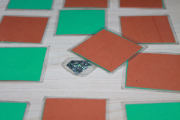
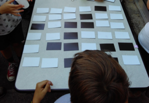
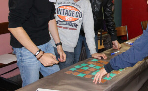
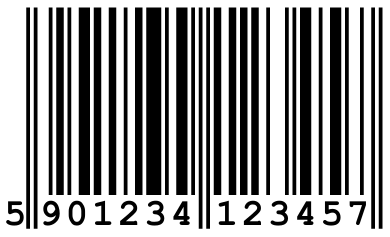

# Carrés magiques

Cette activité se présente comme un tour de magie où l'animateur·ice fait de la
prestidigitation pour deviner une action secrète des participant·es. Le truc
étant basé sur la théorie mathématique des codes correcteurs, faire découvrir ce
truc aux participants est l'occasion d'expliquer comment les ordinateurs
détectent les erreurs de recopies quand ils communiquent sur le réseau.

C'est une activité extrêmement bien rodée, testée de la fin du CP à la formation
continue d'enseignants, en passant par le primaire et le lycée.

### Déroulé

L'activité se joue avec 36 cartes plastifiées toutes identiques mais avec les
deux faces de deux couleurs différentes, et un petit "trésor" que l'on peut
glisser sous une carte sans que ça se voit. Ce tour est beaucoup plus bluffant
avec deux animateurs, mais on peut aussi le jouer seul·e.

Comme c'est un tour de magie, cette première explication est rédigée de façon à
ne pas spoiler les lecteurs. Le truc n'est donné que dans la section suivante,
réservée aux animateur·rices.

* Le magicien s'isole, pour se concentrer et surtout ne pas voir ce qu'il se passe.
* On donne au public 25 cartes, et ils doivent les mettre en 5 lignes de 5
  cartes, en choisissant pour chacune la face visible.
* Le magicien regarde les cartes 5 à 10 secondes pour les mémoriser, puis retourne
  s'isoler.
* L'assistant ajoute ensuite une ligne et une colonne de cartes au prétexte de
  compliquer la situation. On a donc un carré de 6 cartes de côté.
* Le public choisit librement une carte parmi les 36 possibles, la prend, cache
  le trésor dessous et remet la carte en la retournant (et donc en changeant sa
  couleur).
* Le magicien revient. Il regarde les cartes et retrouve le trésor, devant la
  mine incrédule du public.

L'intérêt de placer de petit trésor, c'est qu'il arrive que les participant·es
se trompent et soient persuadé·es d'avoir inversé une autre carte. La présence du
trésor permet d'éviter ces incompréhensions.

Si l'on n'a pas d'assistant·e, il faut adapter légèrement le déroulé ci-dessus
pour que l'animateur·ice tienne les deux rôles. Notez que l'assistant·e peut
aussi être un membre du public qu'on a pris à part avant le début pour lui
expliquer le truc. Avoir un·e assistant·e permet également de s'assurer que les
participant·es ne se trompent pas, et n'oublient pas d'inverser la carte sous
laquelle le trésor est placé.

Quand [Marie Duflot](https://members.loria.fr/MDuflot/files/med/magie.html) a
joué cette activité les premières fois en fête de la science, elle était
l'assistante de sa fille de 8 ans qui jouait la magicienne, pour un effet encore
plus saisissant : les adultes n'en reviennent pas de se faire bluffer par une
enfant. C'est une belle occasion d'expliquer que de trouver une solution à un
problème est autrement plus difficile que d'appliquer une solution que l'on nous
donne toute faite. Et en informatique la tâche difficile de trouver une solution
c'est celle de l'humain qui écrit le programme, et celle bien plus facile de
suivre le programme est le rôle de l'ordinateur. Il est très rapide, très
précis, mais il ne fait rien de particulièrement intelligent. Il obéit.

### Aspects pédagogiques

La difficulté de cette activité est bien un problème d'animation. Le truc est
assez simple mais il s'agit d'accompagner les participant·es pour leur permettre
de découvrir le truc par eux-mêmes. Les accompagner, mais sans spoiler.

On peut donner des fausses pistes au début (comme toquer deux petits coups sur
une carte comme à une porte et faire semblant d'écouter l'écho laissé dans sa
main en disant "non, c'est pas là" ou "ah! ah! attend, ..."), juste pour faire
le spectacle.

Il est important de laisser le public s'exprimer sur les trucs auxquels il
pense, même les plus farfelus. On a souvent le fait que la carte serait
surélevée, qu'on regarderait dans une vitre, que l'assistante faisait des signes
à la magicienne, qu'on avait mémorisé toutes les cartes (mêmes celles que
l'assistant·e ajoute sans que le magicien ne puisse les mémoriser), et voire
même que le magicien utilise une montre connectée ou carrément une puce dans sa
main pour "capter" le trésor en mettant sa main au-dessus.

Il faut démonter ces hypothèses en s'adaptant : se mettre dos à la vitre,
retourner la carte sans y mettre un trésor, ou laisser l'assistant retourner une
dizaine de cartes pendant que le magicien a le dos tourné. S'il y a suffisamment
d'animateur·ices, on peut aussi sauter l'étape où le magicien mémorise les
cartes au bout d'un moment, et lui demander de trouver directement la carte
inversée sur un plateau qu'il n'a jamais vu avant.

#### Différentiation

Guider les participant·es vers la solution n'est pas facile, mais on peut
essayer en insistant sur le mot *"compter"* dans des phrases comme "ok, j'espère
que je vais y arriver ... C'est pas si facile, il ne faut pas que je me trompe
souvent en comptant comme ça m'arrive trop souvent". En pratique, cet
**étayage** est souvent suffisant pour permettre à l'un·e des participant·es
d'intuiter le truc.

Un autre piège d'animation est d'entendre ce qu'on veut entendre dans les pistes
farfelues données par les participant·es. Il ne faut par exemple pas spoiler
trop vite l'activité dès que quelqu'un prononce quelque chose comme "compter",
"nombre pair" ou même "parité". À la place, il faut interdire d'exprimer à voix
haute les hypothèses trop développées (on ne dévoile pas le secret d'un tour de
magie), et proposer à celle ou celui "qui a trouvé" de prendre le rôle du
magicien pour tester son hypothèse. Si l'hypothèse semble confirmée,
l'animateur·ice s'isole avec le participant·e pour vérifier, et l'activité a
gagné un·e co-animateur·ice de plus, qui pourra faire le tour à ses camarades.

À part cela, il n'y a pas vraiment d'**extension** intéressante pour occuper les
plus rapides. Jouer avec plus de cartes complique un peu les dénombrements sans
rien ajouter de fondamental. Vraiment, le mieux est d'embarquer les
participant·es les plus rapides comme co-animateur·ices.

Pas d'inquiétude au final, cela marche toujours. Les participant·es finissent
par comprendre le truc, à condition de prendre le temps. Les élèves de CP
parlent plus facilement de "nombres doubles" que de "nombres pairs**, mais la
solution fini par émerger malgré tout.

#### Spoiler alert! Comment ça marche

Le truc réside dans les 11 cartes ajoutées par l'assistant·e une fois que les
participant·es ont constitué leur motif. Il ne s'agit pas du tout d'augmenter la
complexité comme prétendu, mais seulement de s'assurer qu'il y a un nombre pair
de cartes vertes et rouges dans chaque ligne et dans chaque colonne. S'il y a 4
vertes et une rouge, on ajoute une seconde rouge et le décompte par couleur
devient 4-2 (deux nombres pairs**. S'il y a trois vertes et deux rouges, on
ajoute une verte pour assurer qu'il y a des nombres pairs de cartes vertes et
rouges. Et ainsi de suite.

Quand les participant·es retournent une carte pour placer le trésor, cela
cassent la belle parité de la ligne et la colonne où se trouve cette carte, sans
changer le reste. Le magicien n'a plus qu'à retrouver cette ligne et colonne où
il y a un nombre impaire de cartes vertes et rouges pour trouver la case
inversée à l'intersection.

### C'est de l'informatique !

C'est de l'informatique, parce que cela permet de découvrir ce qu'on appelle un
**code correcteur**. Cette technique est utilisée en informatique pour protéger
les messages que l'on envoi sur le réseau contre les erreurs de transmission.
Comme tout est binaire en informatique, les textes, les sons et les images
envoyées sur le réseau sont systématiquement convertis en 0 et en 1. Quand on
transmet le message, il arrive qu'il soit un peu abîmé : certains 0 sont devenus
des 1 ou inversement, par exemple parce que deux téléphones trop proches
émettaient en même temps, créant des interférences entre leurs ondes.

Dans l'activité, on peut imaginer que les 25 premières cartes déposées par les
participant·es représentent un morceau du message à envoyer sur le réseau :
l'une des faces de chaque carte représente le 0 et l'autre le 1 du binaire. Le
fait de retourner l'une des cartes correspond alors à une erreur de
transmission.

Pour protéger les 25 cartes du message contre ces erreurs, l'assistant ajoute 11
cartes supplémentaires selon un algorithme précis, afin que le récepteur puisse
détecter s'il y a eu une erreur de transmission, et même la corriger.

Les codes correcteurs sont tout une famille de techniques très souvent utilisés
en informatique, pour transmettre des données ou aussi pour les stocker sur
disque. Il existe plusieurs façons de calculer l'**information redondante** que l'on
ajoute au message pour permettre au receveur de détecter d'éventuelles erreurs.
La technique utilisée ici est basée sur des "bits de parité", c'est à dire sur
l'ajout d'une information de parité codée sur un seul bit à chaque fois. 

Les informaticiens désignent l'ajout d'un seul bit sous le nom "[contrôle de
redondance cyclique à un
bit](https://fr.wikipedia.org/wiki/Contr%C3%B4le_de_redondance_cyclique)"
(CRC1). C'est une technique assez pauvre car elle ne permet de détecter qu'une
seule erreur sans savoir la localiser. Deux erreurs de transmission suffisent
même à berner ce code, qui indique alors une transmission sans erreur apparente.
La variante CRC32 sur 32 bits est bien plus souvent utilisée car elle offre une
détection d'erreur plus robuste sans ajouter trop de redondance au message.

L'algorithme utilisé dans cette activité pour calculer l'information redondante
ajoutée au message est un peu plus évolué car il permet de détecter et corriger
une erreur, détecter deux erreurs sans pouvoir les localiser, et il se fait
berner à partir de trois erreurs. Il est par ailleurs relativement bavard car il
ajoute 11 bits pour chaque paquet de 25 bits dans le message d'origine.

Les mathématiciens donnent des outils bien plus efficaces pour construire des
codes correcteurs efficaces et compacts. Les numéros de carte bleue et les
[numéros
IMEI](https://fr.wikipedia.org/wiki/International_Mobile_Equipment_Identity) des
téléphones mobiles utilisent le [code de
Luhn](https://fr.wikipedia.org/wiki/Formule_de_Luhn) pour détecter quelques
erreurs en calculant tous les chiffres modulo 10. Le [numéro de sécurité social
en
France](https://fr.wikipedia.org/wiki/Num%C3%A9ro_de_s%C3%A9curit%C3%A9_sociale_en_France)
est protégé par un code correcteur [plus
puissant](https://scienceetonnante.com/2010/10/01/da-secu-code/) : les deux
derniers chiffres permettent de corriger une erreur sur les 13 premiers chiffres
en calculant la somme modulo 97. Ces codes restent relativement fragiles. Les
[codes d'effacement](https://fr.wikipedia.org/wiki/Code_d%27effacement) sont
encore plus forts : les données écrites sur CD ou DVD utilisent deux encodages
de [Reed-Solomon](https://fr.wikipedia.org/wiki/Code_de_Reed-Solomon)
entrelacés. Le premier niveau permet de corriger jusqu'à deux erreurs par bloc
de 28 octets et détecte comme erroné tout bloc ayant plus de deux erreurs. Le
second niveau permet de reconstruire les blocs corrompus sous certaines
conditions, permettant de lire les données malgré une rayure de plusieurs
millimètres sur le support. La magie de l'opération réside dans les
mathématiques utilisées, issues de la cryptographie.

#### Un autre cas de redondance : le code barre

Les [code-barres](https://fr.wikipedia.org/wiki/Code-barres_EAN) que l'on
retrouve sur la plupart des objets (alimentaires, livres, électroniques, etc)
utilisent également un code correcteur pour éviter les erreurs de saisie. On
retrouve à la fois des barres verticales plus ou moins épaisses, et leur
traduction en 13 chiffres. Si les barres sont faites pour être lues par un
lecteur optique, les chiffres servent en cas de problème à être saisis
directement par des humains.

Lorsqu'on achète des chaussettes, on n’a pas envie que le lecteur se trompe et
nous facture la dernière console à la mode, même si le code barre est abimé ou
replié sur lui même. Pour éviter ce problème, seuls les 12 premiers chiffres
servent à coder le type de produit. Le treizième, lui, sert à détecter les
erreurs. Il est donc calculé en fonction des autres.

Pour trouver ce dernier chiffre (ici le 7) il faut, avec les 12 premiers :

* Prendre un chiffre sur deux en partant du premier, et en faire la
  somme, ici 5 + 0 + 2 + 4 + 2 + 4 = 17
* Prendre un chiffre sur deux en partant du deuxième, en faire la somme et
  multiplier le résultat par 3, ici 9 + 1 + 3 + 1 + 3 + 5 = 22 et 22 * 3 = 66
* Faire la somme des deux résultats obtenus, ici 17 + 66 = 83
* Ne garder que le chiffre des unités, ici 3
* Enfin, retirer ce chiffre à 10. ici 10 - 3 = 7

Ainsi, si le code barre est plié/dégradé, il y a au moins 9 chances sur 10 de
tomber sur un code qui n’existe pas. Encore mieux : si un seul des chiffres est
changé, il est tout bonnement impossible de tomber sur un code valide et on est
sûr de détecter que le code a été mal lu...

### Matériel supplémentaire

À ce jour, personne n'a fait de matériel à imprimer, car il suffit d'avoir du
papier biface, ou bien de coller entre elles deux feuilles de papier colorées
avant de découper des carrés 5cm par 5cm et de plastifier le résultat. On peut
aussi coller une feuille colorée sur du carton plume avant de découper des
jetons.

Le [dépôt git](https://github.com/InfoSansOrdi/pedago-rennes/tree/trunk/src/CarresMagiques)
contient plusieurs fiches de préparation plus ou moins prêtes à l'emploi.

- [Fiche de prép](http://www.irem.univ-bpclermont.fr/IMG/pdf/1FicheProf.pdf) par
  l'IREM de Clermont-Ferrand ([copie local](fiche-prep-carres-magiques-IREM-CF.pdf)).
- [Fiche
  scientifique](http://www.irem.univ-bpclermont.fr/IMG/pdf/2FicheScientifique-4.pdf)
  rédigée par les membres de l'IREM de Clermont-Ferrand contient plus de détails
  sur l'importance des codes correcteurs en informatique ([copie
  locale](fiche-scientifique-carres-magiques.pdf)).

Il n'existe pas encore de trace écrite.

# Références et discussion

Il s'agit de l'une des activités présentes dans le premier livre *Computer
Science* de l'équipe néo-zélandaise, bien décrite [en
ligne](http://csunplugged.org/error-detection) avec de nombreuses illustrations
et extensions.

En France, cette activité est devenue représentative de l'informatique
débranchée en général grâce aux talents de [Marie
Duflot](https://members.loria.fr/MDuflot/) qui s'auto-dénome "informagicienne"
dans ses nombreuses interventions. Marie a rédigé un [page
web](https://members.loria.fr/MDuflot/files/med/magie.html) extrêmement
instructive, dont la présente page reprend beaucoup de matériel (photos
incluses). Merci Marie ! Comme il se doit, le repartage est également sous
licence CC-BY-SA.

Il existe étonnamment peu de retours d'élèves sur cette activité, pourtant
testée de très nombreuses fois avec succès.

- [Repetto et Sok](Rapports/repetto_sok_2023.md) (2023).
