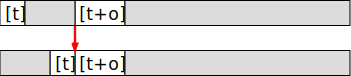
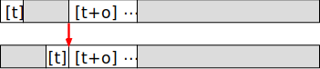
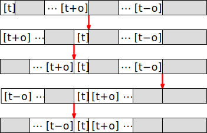
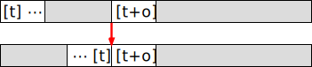
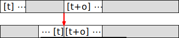
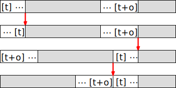
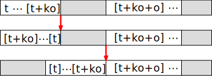
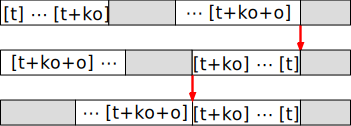

# Crêpier psychorigide

Le but de cette activité est de permettre aux participant·es de découvrir un
algorithme par eux-mêmes. Elle constitue donc une suite logique à une activité
de découverte de la notion d'algorithme comme le [jeu de Nim](Nim/), mais elle
peut également être jouée de façon indépendante.

En pratique, il s'agit de trier des planchettes de bois ou plastique par taille
croissante en appliquant un algorithme systématique.

Cette activité est prête à l'emploi et vraiment rodée. Elle a souvent été jouée
à de très nombreux niveaux, du CM1 à la licence, ainsi qu'en formation
d'enseignants.

Les concepts informatiques mis en avant par cette activité sont les algorithmes,
l'instruction conditionnelle (pour la variante avec les couleurs des faces), la
boucle et même la complexité pour les extensions. Si les participant·es
travaillent en groupe comme conseillé, on apprend de plus à argumenter puis à
verbaliser son raisonnement.

## Déroulé

Le matériel conseillé pour cette activité est celui de la série d'activités SNM.
Ce matériel est prêt à être imprimé sur une feuille A4 autocollante et collé
sur du carton plume. On n'utilise que les six planchettes
rectangulaires dans cette activité, tandis que les petits pions carrés sont
utilisés dans le [jeu de Nim](../Nim/) et l'activité du Baseball multicolore.

 

Les planchettes représentent des crêpes, qu'un crêpier se désespère de trier par
ordre de taille, la plus petite en haut de la pile et la plus grande en bas.

 

Pour y parvenir, il n'a pas le droit de faire plusieurs piles ni de retirer des
crêpes au milieu de la pile. La seule chose qu'il peut faire, c'est d'utiliser
une spatule pour attraper un certain nombre de crêpes en haut de la pile, et les
retourner. Au final, à chaque coup, il ne fait que choisir combien de crêpes du
haut de la pile qu'il veut retourner. L'exemple ci-dessous illustre ce qu'il se
passe  avec la situation initiale ci-dessus s'il décide de retourner quatre
crêpes.

 

Le rôle des participant·es n'est pas seulement de l'aider à trier ses crêpes une
fois, mais de lui donner une façon systématique de trier les crêpes, pour que
son robot puisse le faire chaque jour. Pour cela, il faut trier les crêpes en
essayant d'observer comment on fait pour pouvoir l'expliquer ensuite.

## Aspects pédagogiques

Cette activité se prête bien à une menée progressive pour permettre aux
participant·es de monter en abstraction étape par étape depuis une compréhension
vague de comment trier ces crêpes jusqu'à pouvoir formuler clairement un
algorithme systématique. On procède pour cela en quatre étapes :

- *Avec les mains :* les participants manipulent, sans aucun besoin d'expliquer
  leurs actions.
- *Sans les mains :* il faut ensuite expliquer à une autre personne (qui essaie
  d'être aussi bête qu'un robot) comment trier, sans toucher soi-même les
  crêpes.
- *Sans les yeux :* il faut enfin formaliser ces idées pour pouvoir, sans voir
  les crêpes, dire au robot comment les trier.
- *À plusieurs piles :* un participant donne des consignes génériques à
  plusieurs robots placés dans son dos, qui ont des piles différentes.

Dans la première phase "avec les mains", on laisse les participant·es se
familiariser avec le problème en binômes, ou individuellement si l'on dispose de
suffisamment de matériel.

On passe ensuite à une phase "sans les mains" de travail en trinômes, avec un
*robot* qui tient les crêpes dans ses mains et suit les consignes données par un
*programmeur* sous la surveillance d'un *arbitre*. Le programmeur doit donc
expliciter les consignes au robot pour trier la pile, sans toucher le matériel.
L'arbitre sert également de facilitateur avec le programmeur dans le travail
collaboratif du trinôme.

Si un groupe peine à trouver la stratégie, un bon **étayage** consiste à
conseiller de commencer par mettre la plus grande (la jaune avec le matériel
proposé) tout en bas et de ne plus y toucher. On peut demander s'il y a une
situation dans laquelle il est simple d'emmener la plus grande tout en bas. Les
participant·es proposent alors que c'est le cas quand la grande crêpe est tout
en haut de la pile, puisqu'il suffit de tout inverser dans ce cas. La seconde
question de l'étayage est de savoir comment faire pour emmener la plus grande
crêpe tout en haut, pour qu'il soit ensuite aisé de l'emmener tout en bas. Une
fois ceci fait, il s'agit de recommencer avec la seconde plus grande crêpe (la
violette), mais sans bouger la jaune.

Une fois que la majorité des groupes semble avoir mis en place cet algorithme,
on fait un regroupement où l'on prend un volontaire pour guider l'animateur·ice
qui joue le rôle du robot. Après quelques coups servant à vérifier que le
volontaire a compris, on cache la pile de son regard et on lui demande de
continuer à nous guider en expliquant que l'on ne voit pas ce qu'il se passe dans
un ordinateur en fonctionnement et qu'il faut arriver à diriger le robot malgré
tout. Il suffit pour cela de poser des questions sur ce qu'on veut savoir au
sujet de la pile de crêpes, et le robot répondra. Démarre alors une nouvelle
phase "sans les yeux", où le programmeur de chaque trinôme ne voit pas les
crêpes manipulées par le robot. L'arbitre veille à ce que les consignes soient
appliquées sans erreurs.

La **principale extension** connue pour cette activité consiste à veiller que
les faces colorées soient visibles dans la pile triée. Si la question est posée
par les participant·es au début de l'activité, on conseillera de ne pas tenir
compte des faces visibles lors du tri, avant de réintroduire cet élément avec
les groupes rapides. Une **autre extension** consiste à se demander comment on
ferait pour aider le robot à trouver la plus grande crêpe de la pile s'il ne la
trouvait pas tout seul. De quelles instructions aurait-on besoin pour cet
algorithme-ci ?

On peut faire une quatrième et dernière montée en abstraction après la phase
"sans les yeux", en plaçant plusieurs robots avec des piles mélangées de
différentes façons au tableau face à la classe. Une ou un participante
visiblement douée pour l'exercice vient se placer devant les robots, également
face à la classe. Sa mission est alors de donner les bonnes consignes à tous les
robots dans son dos pour trier leurs piles. La classe joue le rôle d'arbitre,
mais les animateur·ices doivent veiller pour que les interactions restent
bienveillantes même quand la programmeuse hésite. L'idée est de lui faire dire
des choses comme "comptez le nombre de crêpes au-dessus de la plus grande crêpe,
et inversez tout jusqu'à la plus grande incluse", ce qui est presque
l'expression formelle de cet algorithme.

## C'est de l'informatique !

Ce que les participant·es ont trouvé ensemble s'appelle un **algorithme**. Ces
recettes toutes prêtes pour aller d'une situation initiale à une situation
finale sont indispensables en informatique, car les ordinateurs ne font que
suivre très rapidement les consignes du programme sans jamais prendre
d'initiative.

Les participant·es ont donc réinventé un algorithme, mais ce n'est pas ce que
font les informaticien·nes en pratique. Nous apprenons de nombreux algorithmes
pendant notre scolarité, et face à un nouveau problème, nous passons le
catalogue en revue pour trouver l'algorithme connu qui s'applique à ce cas. Face
au matériel du crêpier psychorigide, les gens manipulent les planchettes pour
comprendre avec les mains. De nombreu·ses informaticien·nes se lancent plutôt
dans le dialogue suivant avec l'animateur·ice :

- C'est comme les [tours de Hanoï](https://fr.wikipedia.org/wiki/Tours_de_Hano%C3%AF) ?
- Non, il n'y a qu'une seule pile.
- C'est un tri tout simple alors ? Je peux faire un [tri rapide](https://fr.wikipedia.org/wiki/Tri_rapide) ou un [tri fusion](https://fr.wikipedia.org/wiki/Tri_fusion) ?
- Non, on ne peut pas intervertir deux crêpes dans la pile.
- Mais on peut adapter un [tri par
  sélection](https://fr.wikipedia.org/wiki/Tri_par_s%C3%A9lection) pour résoudre
  le problème récursivement, non ?
- Oui, on peut faire ça.

La manipulation des planchettes ne commence qu'une fois le bon algorithme
identifié. Quand on trouve un problème pour lequel on ne connaît pas
d'algorithme connu, on demande aux collègues s'ils connaissent un algorithme ou
on cherche à décomposer le problème pour pouvoir combiner deux algorithmes
connus. Si le cas est vraiment grave, on peut demander aux chercheurs d'inventer
un nouvel algorithme, mais il est probable de nos jours que si le problème n'a
pas d'algorithme connu, c'est qu'il n'existe pas d'algorithme utilisable en pratique.

### C'est un problème sérieux !

Comme tous les problèmes sérieux, il a un nom scientifique et il a fait l'objet
de publications scientifiques. Son nom anglais est *prefix reversal sorting*
(tri par inversion de préfixe), même s'il est plus connu sous le nom de [tri de
crêpes](https://fr.wikipedia.org/wiki/Tri_de_cr%C3%AApes). Il a été étudié dans
[un article de
1979](https://people.eecs.berkeley.edu/~christos/papers/Bounds%20For%20Sorting%20By%20Prefix%20Reversal.pdf)
intitulé *Bounds for Sorting by Prefix Reversal*, soit "Bornes sur le tri par
inversion de préfixe". Fait amusant, cet article a été co-écrit par Bill Gates
pendant son master à l'université, avant qu'il fonde l'entreprise Microsoft
(c'est d'ailleurs sa seule publication scientifique). Les auteurs démontrent
dans l'article qu'il n'existe pas d'algorithme faisant moins de `17n/16`
inversions pour `n` crêpes, et proposent un algorithme faisant au plus
`(5n+5)/3` inversions, soit mieux que les `2n` inversions de l'algorithme
ci-dessus. L'algorithme de Gates est détaillé en bas de cette page.

La variante utilisée en extension (celle où les faces brûlées doivent rester
cachées) a fait l'objet d'une publication cosignée par [David X.
Cohen](https://fr.wikipedia.org/wiki/David_X._Cohen) (l'un des créateurs de la
série [Futurama](https://fr.wikipedia.org/wiki/Futurama)).

En 2013, Laurent Bulteau a
[obtenu](https://archive.socinfo.fr/recherche/prix-de-these-gilles-kahn/prix-de-these-2013/)
un accessit au prix [Gilles
Kahn](https://archive.socinfo.fr/recherche/prix-de-these-gilles-kahn/) pour [sa
thèse](https://theses.fr/2013NANT2052), qui étudiait divers problèmes autour du
tri par inversion de préfixe. La motivation de ces travaux vient de la
bio-informatique : il arrive qu'un chromosome casse et que le fragment
se recolle dans l'autre sens, ce qui revient à inverser un préfixe. Les
biologistes peuvent mesurer la distance entre espèces au nombre de telles
inversions chromosomiques. Comme prédire le nombre minimal d'inversions pour
trier une pile est un [problème
NP-difficile](https://fr.wikipedia.org/wiki/NP-difficile), on comprend mieux
pourquoi les résultats de trois ans de recherche ont valu à Laurent Bulteau un
accessit de ce prix prestigieux.

L'activité des carrés de Mac Mahon explique ce qu'est un problème NP-difficile, mais
elle n'est malheureusement pas encore intégrée au livre.

## Références et discussion

Le [dépôt
git](https://github.com/InfoSansOrdi/pedago-rennes/tree/trunk/src/CrepierPsychorigide)
contient de nombreuses fiches de préparation plus ou moins prêtes à l'emploi,
ainsi que des traces écrites.

Autres pages décrivant cette activité sur le web :

- Marie Duflot a fait une [page
  web](https://members.loria.fr/MDuflot/files/med/crepier.html) sur ce thème
  (dont certains éléments sont repris ici), ainsi qu'une
  [vidéo](https://www.youtube.com/watch?v=tI6uTAlX-_w&index=2&list=PLWvGMqXvyJAPSMFgCiy6qVHW9bAPu93X5)
  de présentation.
- Vieil article d'[Interstices](https://interstices.info/genese-dun-algorithme/)
- L'IREM de Clermont-Ferrand a [une
  page](http://www.irem.univ-bpclermont.fr/Algorithmique.html) au sujet de cette
  activité, avec une [fiche scientifique](http://www.irem.univ-bpclermont.fr/IMG/pdf/Algorithme-2.pdf) sur la notion d'algorithme ([copie locale](IREM-CF-Algorithme-2.pdf)) ainsi qu'une [fiche de préparation](http://www.irem.univ-bpclermont.fr/IMG/pdf/CrepierVersion2017-05-10.pdf) ([copie locale](IREM-CF-CrepierVersion2017-05-10.pdf)).
- L'IREM de Grenoble a [une page](https://irem.univ-grenoble-alpes.fr/recherche-action/informatique-de-l-ecole-jusqu-au-lycee/activite-algorithmique-crepier-psychorigide-498704.kjsp) avec une trace écrite pour les élèves et une fiche de prep pour l'enseignant ([copie locale de tous les fichiers](IREM-Gre-fichiers.zip)).

Rapports d'expériences des ancien·nes animateur·rices :

{{#include rapports.md}}

## Annexe : l'algorithme de Gates

L'algorithme proposé par Bill Gates est plus efficace que celui utilisé dans
l'activité. L'idée de base est de faire grandir des séquences de crêpes triées,
sans forcément commencer par le bas de la pile. On dira qu'un ensemble de crêpes
dans l'ordre constitue un bloc tandis qu'une crêpe qui n'est pas dans un bloc
est dite libre.

L'algorithme considère la crêpe tout en haut de la pile, dont la taille est
notée `t`, et cherche les deux crêpes de taille `t-1` et `t+1` (le voisin ainsi
considéré est noté `t+o`). Neuf cas sont alors possibles :

- **Cas 1 :** `t` et `t+o` sont tous les deux libres (c'est-à-dire que `t` est
  libre et au moins l'un de `t+1` ou `t-1` est libre). Ils sont alors fusionnés
  en un retournement et constituent maintenant un bloc de taille 2.

  

  Dans tous ces schémas, le sommet de la pile est à gauche et chaque flèche
  rouge représente une inversion. La barre grise et blanche au-dessus de la
  flèche représente l'état de la pile avant l'inversion tandis que la barre sous
  la flèche représente l'état de la pile après l'inversion. Les zones blanches
  représentent des blocs dont certains éléments sont connus tandis que les zones
  grises sont des éléments inconnus entre les zones blanches décrites dans le texte.

- **Cas 2 :** `t` est libre, mais `t+o` est le premier élément d'un bloc. Ils sont
  fusionnés en un bloc.

  

- **Cas 3 :** `t` est libre, mais `t-1` et `t+1` sont tous les deux les derniers
  éléments de blocs. Ces deux blocs ainsi que `t` sont tous fusionnés en quatre
  retournements.

  

- **Cas 4 :** `t` est dans un bloc, mais `t+o` est libre. Ils sont fusionnés en un
  retournement.

  

- **Cas 5 :** `t` est dans un bloc, et `t+o` est le premier élément d'un bloc. Ils
  sont fusionnés en un retournement.

  

- **Cas 6 :** `t` est dans un bloc, et `t+o` est le dernier élément d'un autre
  bloc. Ils sont fusionnés en trois retournements comme suit.

  

- **Cas 7 :** `t` est dans un bloc contenant toutes les crêpes. Si le bloc est
  tête en bas, on retourne toute la pile et on a terminé. Si le bloc est déjà à
  l'endroit, on n'a rien à faire.

- **Cas 8 :** `t` est dans un bloc de taille `k+1` (le dernier élément est
  `t+ko`). L'élément suivant (noté `t+ko+o`) est soit libre, soit le dernier
  élément d'un autre bloc. Les deux blocs sont fusionnés en deux retournements :

  

- **Cas 9 :** `t` est dans un bloc de taille `k+1` (le dernier élément est
  `t+ko`). L'élément suivant `t+ko+o` est le premier élément d'un autre
  bloc (la différence avec le cas précédent est que `t+ko+o` est maintenant le
  premier élément de son bloc). Les deux blocs sont fusionnés en deux
  retournements :

  

Cet algorithme est un peu fastidieux avec ses neufs cas relativement complexes,
mais il est plus efficace. Comme chaque itération augmente strictement la taille
des blocs, la terminaison est certaine. Une analyse fine montre qu'il prend au
plus `(5n+5)/3` étapes pour trier la pile. C'est mieux que l'algorithme naïf,
qui nécessite `2n-3` étapes pour cela : S'il y a 100 crêpes, l'algorithme de
Gates fait moins de 168 inversions tandis que l'algorithme naïf en fait jusqu'à 197.
