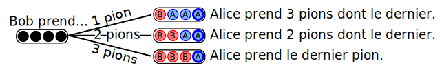

# Jeu de Nim

Cette activité permet d'introduire la notion d'**algorithme** en la reliant à la
stratégie d'un jeu à deux joueurs. Elle a été testée très souvent à partir du
cycle 3 (dès le CM1).

- **Concepts.** Algorithme: 2; Langage: 0; Information: 0; Machine: 0.
- **Compétences.** Pensée algorithmique: 2; Abstraction: 1; Décomposition: 2; Généralisation et motifs 1; Evaluation: 0; Logique: 1
- **Compétences non-informatiques.** développer un vocabulaire précis

## Matériel et déroulé

C'est un jeu à deux joueurs où l'on dispose de 12, 16 ou 20 objets quelconques.
On peut utiliser des allumettes comme dans la [variante de
Marienbad](https://fr.wikipedia.org/wiki/Jeu_de_Marienbad) ou des petits
cailloux, mais il est plus pratique d'utiliser les petits jetons de la série
d'activité SMN. Ce matériel est prêt à être imprimé sur une feuille A4
autocollante, puis collé sur du carton plume. On n'utilise que les petits pions
carrés dans cette activité, tandis que les grands rectangles sont utilisés dans
l'activité du [Crépier psychorigide](../CrepierPsychorigide/) et celle du Baseball
multicolore.

 

Chaque joueur à son tour prend 1, 2 ou 3 objets, et le but est de prendre le dernier
objet sur la table. Les participants connaissent souvent la variante de
l'émission de télévision *Fort Boyard*, où l'objectif est de **ne pas** prendre
le dernier objet.

L'intérêt de l'activité est l'existence d'une stratégie gagnante, que les
participants vont devoir découvrir en jouant ensemble, avant de la co-construire
pendant la remise en commun.

Après avoir donné la consigne, laissez jouer les participants. Passez dans les
groupes et jouez contre des participants. Quand ils s'étonnent de vous voir
gagner à tous les coups, avouez qu'il y a un truc, et que l'objectif de la
séance est de le découvrir.

Si votre adversaire insiste pour vous laissez commencer, jouez au hasard, et
rattrapez la stratégie gagnante à la première erreur. Si un participant connaît
déjà la stratégie gagnante du jeu, il pourra vous aider en jouant avec les
autres participants sans leur spoiler l'algorithme.

## Aspects pédagogiques

Certains joueurs prennent le jeu trop à coeur. Il faut insister sur
l'importance de trouver la stratégie pour leur éviter la frustration
de perdre à coup sûr.

#### Un algorithme pour gagner

Il existe donc une **stratégie gagnante** pour permettre au second joueur de gagner
à coup sûr : il doit laisser 4, 8, 12 ou 16 pions (un multiple de 4) à la fin de son tour.

Pour se convaincre de l'efficacité de cette stratégie, observons par exemple le
dernier tour. Il reste 4 pions, et c'est à Bob de jouer. Quoi que fasse Bob,
Alice peut gagner dans tous les cas.

Donc Alice *peut* gagner à coup sûr quand il reste 4 pions au tour de Bob. De la
même manière, s'il reste 8 pions à Bob, Alice peut le forcer à jouer avec 4
pions au tour suivant. En jouant ainsi dès le début, elle peut gagner à coup sûr.

#### Différenciations

Le seul **étayage** connu consiste à jouer avec les groupes en difficulté, de
préférence en deuxième pour pouvoir appliquer la stratégie qu'ils doivent
découvrir mais avec un maximum de bienveillance pour limiter leur frustration de
perdre à coup sûr. Si le groupe ne trouve vraiment pas (ce qui est rare), on
peut disposer les jetons sur la table par groupe de quatre (par exemple par
couleur) et prendre systématiquement les derniers jetons de chaque paquet
entamé.

De **nombreuses extensions** sont possibles :

* On fait varier le nombre de jetons sur la table : "s'il y a maintenant 15
  jetons sur la table, tu commences ou je commence?" (réponse: la stratégie est
  maintenant pour le joueur qui commence)

* Variante de la règle : on a maintenant le droit de prendre un ou deux jetons
  seulement, et il y a 15 jetons sur la table. Tu commences ou je commence?
  (réponse: la stratégie est maintenant de laisser un nombre de jeton qui soit
  un multiple de trois. Avec 15 jetons, c'est pour le second joueur que la
  stratégie s'applique).

* Et si on peut prendre 1, 2, 3 ou 4 objets à la fois, tu commences ou je
  commence ?

* On peut jouer à la version de Fort Boyard, où il s'agit de ne pas prendre le
  dernier jeton. La stratégie gagnante dans ce cas est de laisser un nombre de
  jetons qui *ne soit pas* un multiple de 4. Avec 16 jetons initialement, le
  premier joueur peut l'appliquer et gagner.

* Plus difficile : On peut maintenant prendre 1 ou 3 jetons. Trouver la stratégie
  demande de dessiner un automate des différentes configurations avec les coups
  autorisés dans chaque cas, et appliquer l'algorithme de
  [Min-Max](https://fr.wikipedia.org/wiki/Algorithme_minimax) sur ce graphe pour
  trouver la stratégie. Cette variante mériterait d'être mieux décrite ici, mais
  elle tiendra certainement même les participant·es les plus rapides occupé·es  le
  temps que le reste du groupe trouve la version de base.

## C'est de l'informatique !

Les ordinateurs ne prennent pas d'initiative, mais ils se contentent de faire
(extrêmement vite) ce que leur programme leur dit de faire. Les algorithmes sont
donc très importants pour assurer que l'ordinateur fasse à coup sûr ce que l'on
attend de lui. D'une certaine façon, programmer un ordinateur c'est chercher la
stratégie gagnante l'emmenant à coup sûr d'une situation initiale à la situation
finale attendue.

On a parfois l'impression que les ordinateurs sont intelligents, mais il ne
s'agit le plus souvent que de comportement prédéterminés à très grande vitesse.
Dans un dessin animé, nous voyons une animation alors qu'il n'y a qu'une
succession d'images fixes. De la même façon, les étapes prédéfinies d'un
programme nous semblent donner de l'intelligence à l'ordinateur.

Certains algorithmes peuvent *apprendre* de leurs essais (on parle alors
d'intelligence artificielle), ou tirent leurs actions au hasard (ce sont des
algorithmes randomisés). Mais au final, leur procédure pour apprendre ou pour
tirer au hasard est toujours pré-déterminée par le programme utilisé.

## Matériel supplémentaire

Le [dépôt git](https://github.com/InfoSansOrdi/pedago-rennes/tree/trunk/src/Nim)
contient de nombreuses fiches de préparation plus ou moins prêtes à l'emploi,
ainsi que des traces écrites. Exemple de [fiche de
préparation](nim_prep_2017_BautistaBordais.pdf) et de [trace
écrite](nim_trace_ecrite.pdf).

## Références et discussion

Cette activité est un grand classique du folklore de la médiation mathématique,
comme détaillé sur la [page wikipedia
associée](https://fr.wikipedia.org/wiki/Jeux_de_Nim). Quelques autres liens la
décrivant :

- Une [fiche du site
  Pixees](http://people.irisa.fr/Martin.Quinson/Mediation/SMN/) est consacrée à
  cette activité.
- Marie Duflot a [une page](https://members.loria.fr/MDuflot/files/med/nim.html) 
  et elle a fait [une
  vidéo](https://www.youtube.com/watch?list=PLWvGMqXvyJAPSMFgCiy6qVHW9bAPu93X5&v=3WIghG_B4nU)
  sur le jeu de Nim.
- Les IREM de Clermont et Grenoble ont des pages très bien faites sur cette
  activité, mais ces sites changent tout le temps d'organisation. Il est
  difficile d'ajouter un lien ici sans qu'il devienne obsolète en quelques mois.
  Utilisez les fonctions de recherche de ces sites pour retrouver les
  ressources.
- Pour une variante avec une stratégie plus compliquée, allez donc voir le [jeu
  de Marienbad](https://fr.wikipedia.org/wiki/Jeu_de_Marienbad). Il y a
  plusieurs piles, et on ne peut prendre des jetons que dans une seule pile à la
  fois. On peut voir la stratégie de cette variante comme une extension 2D de la
  stratégie du jeu de base, assez linéaire puisqu'on compte avec un seul entier.

### Rapports d'expériences

{{#include rapports.md}}
