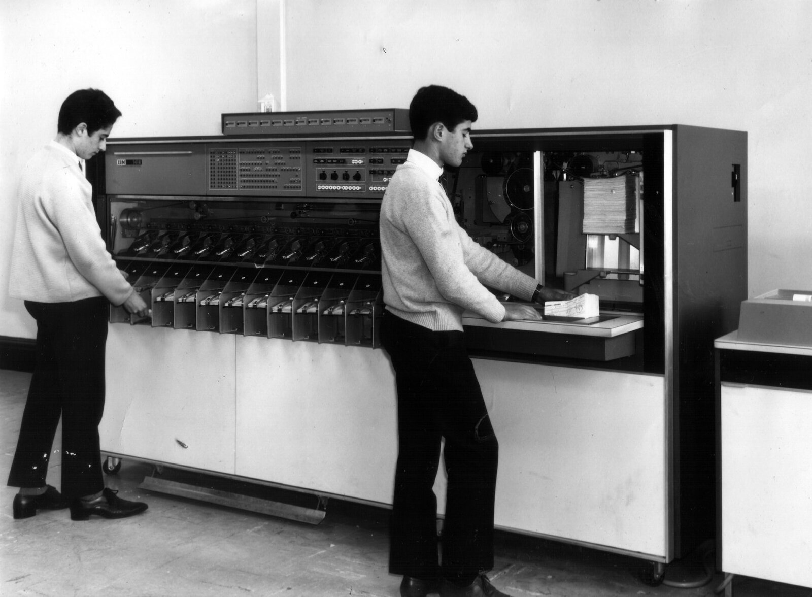

# Tris de cartes

On trouve ici plusieurs activités complémentaires autour du tri des cartes. La première
vise à expliquer l'intérêt du tri et de la recherche dichotomique, tandis que la
seconde permet de découvrir quelques algorithmes de tris classiques.

Ces activités sont rodées et testées à la fois en CM2 et au lycée, mais elles ne sont
pas toujours très fun à jouer. Il s'agit plutôt d'activités scolaires classiques que
de vrais jeux.

**Compétences mathématiques.**
 Comparer des nombres entiers (cycle 3).

## Déroulé

Cette activité se découpe en trois phases, modulable à l'envi des animateur·ices.

### Phase "c'est le bazar"

On distribue à chaque binôme de participant·es des cartes, de préférence de la même
famille pour simplifier les comparaisons. Il peut être suffisant d'en distribuer 6 ou
7 en primaire, mais il en faut bien 10 au lycée pour que l'activité soit
intéressante.

À tour de rôle, un membre du binôme choisi une carte de la pile, annonce sa carte à
son camarade, mélange les cartes, puis les étale face cachée sur la table. Son
camarade retourne alors les cartes une à une dans l'ordre de son choix, jusqu'à
trouver la carte recherchée.

Quand la carte est trouvée, le groupe annonce le nombre de cartes qu'il a fallu
retourner pour la trouver à l'animateur·ice, qui note au tableau les résultats
annoncés. On fera une ligne par valeur possible (de 1 à 10), en mettant un bâton sur
la ligne 3 si un groupe nous dit avoir trouvé en 3 coups. Le binôme recommence à
jouer après avoir annoncé son score. Le tableau se remplit, les binômes refont des
expériences jusqu'à ce que chaque valeur soit bien représentée (ou qu'on en ait
marre).

On peut discuter stratégie avec les groupes qui obtiennent les meilleurs scores (une
ou deux cartes retournées seulement), mais il n'y a pas de stratégie à ce jeu (sauf à
tricher). Les meilleurs scores ne sont dus qu'à la chance.

### Phase "dichotomie"

Après avoir tracé un grand trait vertical au tableau pour séparer les anciens
essais de ce qui arrive, on joue maintenant avec des cartes triées. La personne
qui choisit la carte ne dit plus la valeur de la carte dès le départ. À la
place, il indique si la carte retournée est celle cherchée, ou bien si la carte
à trouver est plus grande ou plus petite que la carte retournée.

Comme auparavant, l'animateur·ice tient des statistiques du nombre de coups qu'il a
fallu jouer avant de retourner la bonne carte. Même si l'on n'a pas fait assez
d'expériences pour que les répartitions soient vraiment représentatives, on voit une
nette différence. Avant, on avait des valeurs entre 1 et 10, après les valeurs
au-dessus de 4 sont rares.

Discuter des meilleures stratégies avec la classe permet à tout le monde de trouver la
stratégie de recherche par dichotomie. On continue ensuite jusqu'à ce que plus
personne n'ait besoin de plus de 4 coups pour gagner.

On lance ensuite une discussion sur le nombre maximal de coups à jouer avec 10
cartes. La réponse est 4 : s'il fallait deviner 1, je vais jouer 5, 3, 2, 1. On
augmente ensuite le nombre de cartes. Avec la méthode dichotomique (prendre à chaque
fois la carte du milieu parmi les cartes encore possibles) on élimine à chaque tour
la moitié des cartes restantes. Avec 52 cartes, j'en retourne une des deux du milieu,
et si je n'ai pas directement gagné on me dit si c'est plus petit ou plus grand et il
me reste selon les cas 25 ou 26 cartes. Si j'en ai 26 en en retournant une de plus il
m'en reste 13, puis en retournant celle du milieu il en restera 6, puis 3, puis 1
puis au coup d'après je suis sûre d'avoir gagné. Pour 52 cartes le nombre maximum à
retourner est donc 6.

Avec des lycéens, on demande ensuite combien de cartes, il faudrait retourner si on en
avait un million (soit 55 km de cartes si elles font 5,5cm de large). Après une prise
de représentations, on refait le calcul ensemble (comme ci-dessus avec 52 cartes), et
l'on arrive au fait que 20 cartes sont suffisantes pour trouver la bonne parmi un
million. Cela bluffe en général les participants (sauf si ce sont des matheux, bien
sûr), et c'est l'occasion de mentionner le logarithme car le logarithme à base 2 est
précisément la fonction indiquant combien de fois on doit diviser un entier par deux
pour arriver à 1. En primaire, cet aparté est hors sujet.

### Phase "recherche d'algorithmes"

Cette phase peut constituer une autre séance en primaire, ou justifier que l'on aille
plus vite au début pour que tout tienne dans le temps imparti. Elle peut même être
jouée seule, sans avoir justifié au préalable l'intérêt des tris.

On distribue encore une fois une dizaine de cartes par binôme. L'un des membres du
groupe doit trier les cartes face cachée, sans regarder leur valeur. Il est libre de
les arranger comme il le souhaite et peut demander à son camarade de comparer la
valeur de deux cartes. Le comparateur (seul à pouvoir regarder les faces des cartes)
indique alors quelle carte est la plus grande, sans lui donner les valeurs. Les rôles
tournent après une réussite, ou si on n’avance pas.

On peut entrecouper la période d'expérimentations en binôme par des remises en
commun où l'on cherche à faire émerger des algorithmes. Les tris classiques
comme le tri à bulle (on trie tant qu'on n'a pas fini, c'est-à-dire : je compare
les cartes deux à deux de droite à gauche et j'inverse celles qui sont à
l'envers. Quand j'ai fini un parcours, si je n'ai rien eu à inverser, c'est que
c'est trié et j'arrête), le tri par insertion (on considère la carte à la
frontière entre la partie triée et la partie non triée, et on la place au bon
endroit dans la partie triée) et le tri par sélection (on choisit la plus petite
carte de la partie non triée, et on la place à la frontière) sont à portée de
tous participant·es. Les tris récursifs comme le tri fusion et le tri rapide
sont également réalisables, si l'on dispose de beaucoup de temps. Le tri par tas
est probablement hors de portée.

## Aspects pédagogiques

La plus grosse difficulté de cette activité est de choisir à l'avance ce que
l'on va faire dans le temps imparti, sachant qu'il est très difficile de faire
l'intégralité des trois phases en 55 minutes dans de bonnes conditions.

Si vous décidez d'utiliser des nombres inscrits sur des bouts de papier au lieu de
cartes à jouer, il est préférable en primaire d'en rester à des nombres à deux
chiffres, sous peine d'exclure certains élèves. Écrire assez gros et utiliser des
couleurs différentes pour les dizaines et les unités permet de plus d'inclure les
élèves dyspraxiques.

Les phases de découverte de la dichotomie sont assez faciles à animer, car elles sont
très guidées. Être plusieurs animateur·rices permet de passer dans les rangs pour
vérifier que tous les binômes ont compris les consignes et avancent sans bloquer,
tandis que l'un·e des animateur·rices reste au tableau pour noter les résultats
annoncés, avant de les discuter avec le groupe classe.

La phase de découverte des algorithmes est plus ouverte, et peut nécessiter des
différentiations. Un bon **étayage** consiste à jouer avec les binômes en appliquant
un algorithme simple à découvrir (comme le tri à bulle) pour inspirer les
participant·es. Les **extensions** les plus simples consistent également à jouer avec
les binômes, en appliquant d'autres algorithmes simples.

Demander d'évaluer les algorithmes de tris est probablement trop difficile au
cycle 3, mais cela pourrait faire l'objet d'une quatrième phase avec des
lycéens. Elle serait similaire aux deux premières phases : on coupe la classe en
deux, et l'on donne l'algorithme du tri à bulle à la moitié des binômes et celui
du tri fusion aux autres. On note au tableau le nombre de comparaisons
nécessaires avec chaque algorithme, avant de comparer.

## C'est de l'informatique !

C'est de l'informatique, parce que les ordinateurs passent une partie importante
de leur temps à trier des informations afin d'y accéder plus rapidement ensuite.
C'est tellement important que le mot "ordinateur" est de la même famille que
"ordonner" (en ancien français, "ordinateur" désignait Dieu dans le sens "celui
qui organise le monde").

Les ancêtres des ordinateurs modernes ont été inventés pour trier des
informations. Dès 1890, [Herman
Hollerith](https://fr.wikipedia.org/wiki/Herman_Hollerith) invente une machine
électromécanique pour traiter les données du recensement de la population
américaine plus efficacement. Il fondera ensuite IBM, devenue l'une des plus
grosses entreprises informatique au monde. Cette entreprise commercialise depuis
bientôt 150 ans des machines permettant de [trier des cartes
perforées](https://fr.wikipedia.org/wiki/Trieuse) et de [faire des
statistiques](https://fr.wikipedia.org/wiki/Tabulatrice) sur les informations
contenues. Ces opérations étaient également l'occupation principale des premiers
ordinateurs commerciaux dans les années 1960. Le premier programme informatique
de tri a été écrit par [Betty
Holberton](https://fr.wikipedia.org/wiki/Betty_Holberton) à la fin des années
1940.

(Photo d'une trieuse IBM 1419 des années 1960, crédit [Wikipédia](https://en.wikipedia.org/wiki/IBM_document_processors))

### En savoir plus

Il existe de nombreux algorithmes de tri, que les futurs informaticien·nes
apprennent par coeur au début de leur scolarité. [Cet
article](https://interstices.info/les-algorithmes-de-tri/) d'Interstices
présente les plus classiques, avec une petite appli javascript pour voir les
différentes étapes. Les animations de [cette
page](https://www.toptal.com/developers/sorting-algorithms) donnent une
meilleure idée de l'efficacité comparée des algorithmes. La [page
wikipedia](https://fr.wikipedia.org/wiki/Algorithme_de_tri) correspondante est
également bien faite.

## Matériel supplémentaire

Le [dépôt git](https://github.com/InfoSansOrdi/pedago-rennes/tree/trunk/src/TrisDeCartes)
contient de nombreuses fiches de préparation plus ou moins prêtes à l'emploi,
ainsi que des traces écrites. 

- [Fiche scientifique](http://www.irem.univ-bpclermont.fr/IMG/pdf/2FicheScientifique-3.pdf)
  rédigée par les membres de l'IREM de Clermont-Ferrand présente l'intérêt
  historique du tri des cartes perforées, avant de présenter plusieurs
  algorithmes classiques ([copie locale](2FicheScientifique-3.pdf)).

### Discussion pédagogique

Utiliser une pile de cartes pour montrer l'intérêt des algorithmes de tri est
très classique. La séquence "C'est le bazar" justifiant l'intérêt des
algorithmes de tris par une recherche dichotomique est une idée de Marie Duflot,
qui a [une page web](https://members.loria.fr/MDuflot/files/med/bazar.html) à ce
sujet.

### Rapports d'expériences

{{#include rapports.md}}
